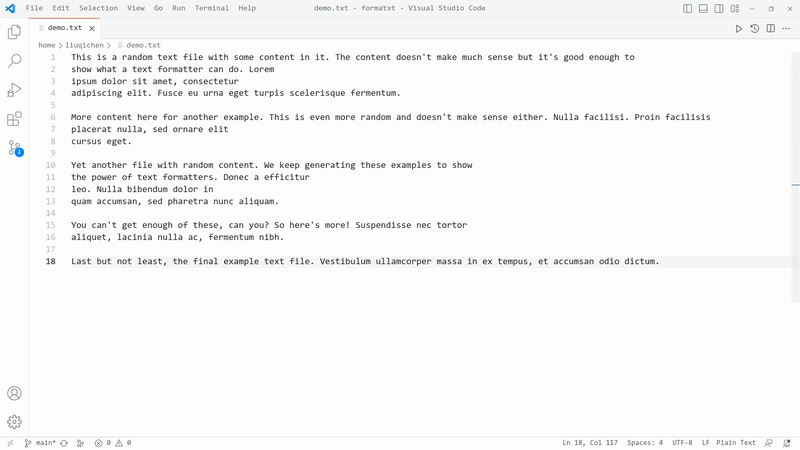

# FormaTXT: A Plain Text Formatter

Easily format your .txt files—or any other plaintext files—by making every line the same length while preserving paragraphs.

## How to Use

### Format an entire file

1. Open the Command Palette in your current .txt file by pressing `Ctrl + Shift + P`.
2. Type "FormaTXT" in the search bar and select it.
3. Press `Enter` to specify a custom line width or stick with the default width.
4. Press `Enter` again to format your .txt file.

> **Note:** If you're working with a non-.txt file, the extension will prompt you to confirm whether you want to proceed.

### Format a certain text block

1. Select the text block you want to format
2. Right-click to open the context menu
3. Choose to either format the text using the default line width or specify a custom line width.
>**Note:** If you do not select a complete block of text, you will be prompted to confirm whether you want to proceed.

## Links

- Find the source code for this extension on [GitHub](https://github.com/Q1CHENL/formatxt-vsce). Give it a star if you find it useful ^_^
- Find the extension also in [vscode extension marketplace](https://marketplace.visualstudio.com/items?itemName=qichenliu.formatxt).
