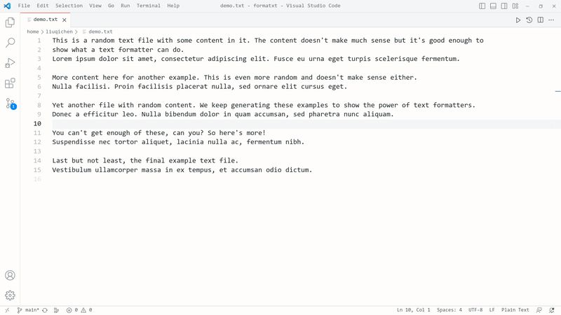

# FormaTXT: A Plain Text Formatter

Easily format your .txt files—or any other plaintext files—by making every line the same length while preserving paragraphs.

## How to Use

1. Open the Command Palette in your current .txt file by pressing `Ctrl + Shift + P`.
2. Type "FormaTXT" in the search bar and select it.
3. Press `Enter` to specify a custom line width or stick with the default width.
4. Press `Enter` again to format your .txt file.

> **Note:** If you're working with a non-.txt file, the extension will prompt you to confirm whether you want to proceed.

## Source Code

Find the source code for this extension on [GitHub](https://github.com/Q1CHENL/formatxt-vsce).
